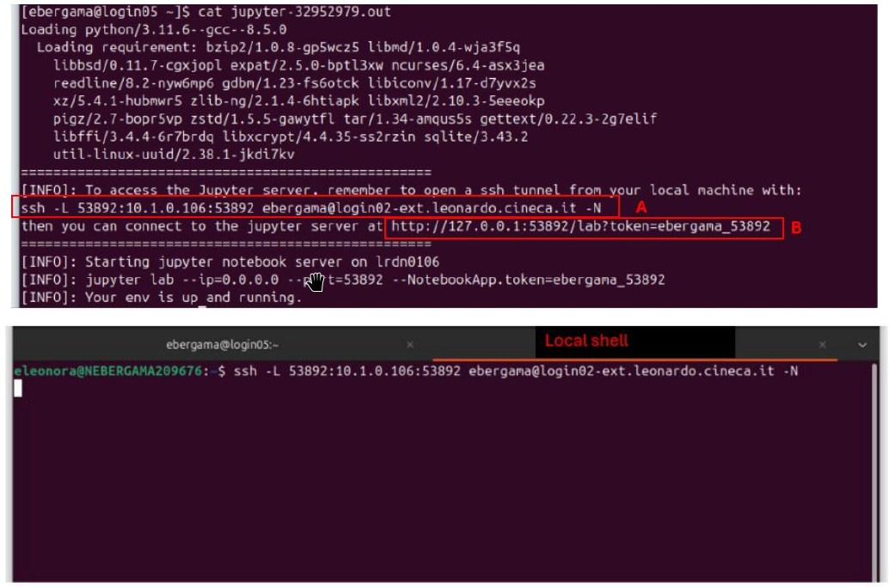

# 1M: Access to Leonardo

```{note}
You can find general documentation for
- our HPC systems here: <https://docs.hpc.cineca.it/hpc/hpc_intro.html>, and 
- Leonardo specifics here: <https://docs.hpc.cineca.it/hpc/leonardo.html#leonardo-card>

```

The project account on Leonardo Booster partition is `tra26_castiel2`. Two shared areas are available to all project collaborators: `$WORK` and `$FAST`, accessible via the corresponding commands `$WORK` and `$FAST`.
Compute nodes do not have internet access. Any required models or data should therefore be downloaded in advance using the `lrd_all_serial` partition. The `$FAST` area provides faster I/O and already contains two folders, data and models. We recommend storing preloaded datasets and models there so they can be accessed directly by students.

## Slides

- {download}`Jupyter on CINECA HPC <../IntroductionJupyter.pdf>`
- {download}`Introduction to CINECA HPC infrastructure and Leonardo <../IntroductionLeonardo.pdf>`

(jupyter)=
## Jupyter

To run jupyter notebooks on Leonardo we have to use double ssh tunnel. It is suggested to use jupyter notebooks within the node and use normal scripting and job submission for more than 1 nodes.

To open a notebook directly on a compute node a double ssh tunnel is required following
the steps below:

1. On **localhost (local shell** on your pc, for Windows users use Putty), open an ssh
session to Leonardo login node (i.e: `login01-ext.leonardo.cineca.it`) with the
command:

        ssh USERNAME@login01-ext.leonardo.cineca.it

2. Once you have logged into Leonardo, enter the folder where you have saved the
desired notebooks you want to use, and submit the job (see below for the jobscript):

        sbatch start_jupyter.sh

3. On a **local shell**, open an ssh double tunnel by copying the command written in the
output file (.out) associated to the job (**string A**):



4. Open a browser and go to the URL to connect the jupyter server (**string B**)

The `start_jupyter.sh` jobscript:

```{literalinclude} start_jupyter.sh
:language: bash
```

## Setting up Python

### The `cineca-ai` Module

If you don't require specific versions to run your hands-on sessions, we suggest to use the module `cineca-ai` available on Leonardo which already contains the most commonly used Python libraries for AI applications. You can find more information about how to use it here. <https://docs.hpc.cineca.it/hpc/hpc_cineca-ai-hpyc.html> 

### Virtual environment

If you are creating a virtual environment for your scripts to run and not using the CINECA modules, please make sure that they can be loaded and modified (if the need arises) by students. You can also create a shared virtual environment on FAST area and have the file with required packages ready in case importing them takes too long. To create a virtual environment, we recommend loading the Python module and using Pip to install packages.

## Running jobs

If you need to run jobscripts that require fewer than 2 nodes and last less than 30 minutes, you can use the QoS debugging by specifying the SLURM directive `--qos boost_qos_dbg` (it has a higher priority and you can obtain your resources earlier).
