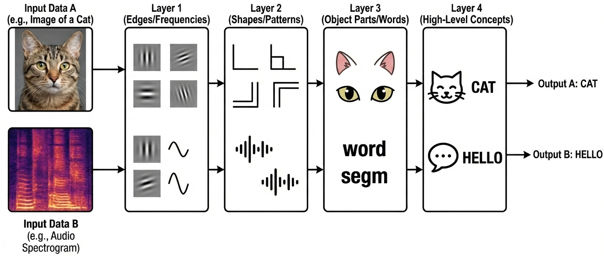

::::::::::::::::::::::::::::::::::::::{questions}

- What is deep learning?
- What is a neural network?
- Which operations are performed by a single neuron?
- How do neural networks learn?
- When does it make sense to use and not use deep learning?
- What are tools involved in deep learning?
- What is the workflow for deep learning?
- Why did we choose to use Keras in this lesson?

::::::::::::::::::::::::::::::::::::::::::::::::

::::::::::::::::::::::::::::::::::::::{objectives}

- Define deep learning
- Describe how a neural network is build up
- Explain the operations performed by a single neuron
- Describe what a loss function is
- Recall the sort of problems for which deep learning is a useful tool
- List some of the available tools for deep learning
- Recall the steps of a deep learning workflow
- Test that you have correctly installed the Keras, Seaborn and scikit-learn libraries

::::::::::::::::::::::::::::::::::::::::::::::::


## What is Deep Learning?


### Deep Learning, Machine Learning and Artificial Intelligence

Deep learning (DL) is just one of many techniques collectively known as machine learning. Machine learning (ML) refers to techniques where a computer can "learn" patterns in data, usually by being shown numerous examples to train it. People often talk about machine learning being a form of artificial intelligence (AI). Definitions of artificial intelligence vary, but usually involve having computers mimic the behaviour of intelligent biological systems. Since the 1950s many works of science fiction have dealt with the idea of an artificial intelligence which matches (or exceeds) human intelligence in all areas. Although there have been great advances in AI and ML research recently we can only come close to human like intelligence in a few specialist areas and are still a long way from a general purpose AI.
The image below shows some differences between artificial intelligence, machine learning and deep learning.


{ align=center width=408px }


#### Neural Networks

A neural network is an artificial intelligence technique loosely based on the way neurons in the brain work.
A neural network consists of connected computational units called **neurons**.
Let's look at the operations of a single neuron.

##### A single neuron
 Each neuron ...

- has one or more inputs ($x_1, x_2, ...$), e.g. input data expressed as floating point numbers
- most of the time, each neuron conducts 3 main operations:
  + take the weighted sum of the inputs where ($w_1, w_2, ...$) indicate weights
  + add an extra constant weight (i.e. a bias term) to this weighted sum
  + apply an **activation function** to the output so far, we will explain activation functions
- return one output value, again a floating point number.
- one example equation to calculate the output for a neuron is: $output = Activation(\sum_{i} (x_i*w_i) + bias)$


{ align=center width=600px }

##### Activation functions
The goal of the activation function is to convert the weighted sum of the inputs to the output signal of the neuron.
This output is then passed on to the next layer of the network.
There are many different activation functions, 3 of them are introduced in the exercise below.

::::{challenge} Activation functions
Look at the following activation functions:

**A. Sigmoid activation function**
The sigmoid activation function is given by:
$$ f(x) = \frac{1}{1 + e^{-x}} $$

{ align=center width=476px }
<br clear="all" />

**B. ReLU activation function**
The Rectified Linear Unit (ReLU) activation function is defined as:
$$ f(x) = \max(0, x) $$

This involves a simple comparison and maximum calculation, which are basic operations that are computationally inexpensive.
It is also simple to compute the gradient: 1 for positive inputs and 0 for negative inputs.

{ align=center width=476px }
<br clear="all" />

**C. Linear (or identity) activation function (output=input)**
The linear activation function is simply the identity function:
$$ f(x) = x $$

{ align=center width=476px }
<br clear="all" />


Combine the following statements to the correct activation function:

1. This function enforces the activation of a neuron to be between 0 and 1
2. This function is useful in regression tasks when applied to an output neuron
3. This function is the most popular activation function in hidden layers, since it introduces non-linearity in a computationally efficient way.
4. This function is useful in classification tasks when applied to an output neuron
5. (optional) For positive values this function results in the same activations as the identity function.
6. (optional) This function is not differentiable at 0
7. (optional) This function is the default for Dense layers (search the Keras documentation!)

_Activation function plots by Laughsinthestocks - Own work, CC BY-SA 4.0, <https://commons.wikimedia.org/w/index.php?curid=44920411>,
<https://commons.wikimedia.org/w/index.php?curid=44920600>, <https://commons.wikimedia.org/w/index.php?curid=44920533>_

:::{solution} Solution
1. A
2. C
3. B
4. A
5. B
6. B
7. C
:::
::::


##### Combining multiple neurons into a network
Multiple neurons can be joined together by connecting the output of one to the input of another. These connections are associated with weights that determine the 'strength' of the connection, the weights are adjusted during training. In this way, the combination of neurons and connections describe a computational graph, an example can be seen in the image below.

In most neural networks, neurons are aggregated into layers. Signals travel from the input layer to the output layer, possibly through one or more intermediate layers called hidden layers.
The image below shows an example of a neural network with three layers, each circle is a neuron, each line is an edge and the arrows indicate the direction data moves in.

{ align=center }
:::::::::::note
Image credit: Glosser.ca, CC BY-SA 3.0 <https://creativecommons.org/licenses/by-sa/3.0>, via Wikimedia Commons, 
original source: <https://commons.wikimedia.org/wiki/File:Colored_neural_network.svg>
:::::::::::


::::{challenge} Neural network calculations
.

#### 1. Calculate the output for one neuron
Suppose we have:

- Input: X = (0, 0.5, 1)
- Weights: W = (-1, -0.5, 0.5)
- Bias: b = 1
- Activation function _relu_: `f(x) = max(x, 0)`

What is the output of the neuron?

_Note: You can use whatever you like: brain only, pen&paper, Python, Excel..._

#### 2. (optional) Calculate outputs for a network

Have a look at the following network where:

* $X_1$ and $X_2$ denote the two inputs of the network.
* $h_1$ and $h_2$ denote the two neurons in the hidden layer. They both have ReLU activation functions.
* $h_1$ and $h_2$ denotes the output neuron. It has a ReLU activation function.
* The value on the arrows represent the weight associated to that input to the neuron.
* $b_i$ denotes the bias term of that specific neuron
{ align=center width=400px }

a. Calculate the output of the network for the following combinations of inputs:

| x1 | x2 | y |
|----|----|---|
| 0  | 0  | ..|
| 0  | 1  | ..|
| 1  | 0  | ..|
| 1  | 1  | ..|

b. What logical problem does this network solve?

:::{solution} Solution

#### 1: calculate the output for one neuron

You can calculate the output as follows:

* Weighted sum of input: `0 * (-1) + 0.5 * (-0.5) + 1 * 0.5 = 0.25`
* Add the bias: `0.25 + 1 = 1.25`
* Apply activation function: `max(1.25, 0) = 1.25`

So, the neuron's output is `1.25`

#### 2: Calculate outputs for a network
a.
| x1 | x2 | y     |
|----|----|---    |
| 0  | 0  | **0** |
| 0  | 1  | **1** |
| 1  | 1  | **0** |
| 1  | 0  | **1** |

b. This solves the XOR logical problem, the output is 1 if only one of the two inputs is 1.

:::
::::

##### What makes deep learning deep learning?
Neural networks are not a new technique, they have been around since the late 1940s. But until around 2010 neural networks tended to be quite small, consisting of only 10s or perhaps 100s of neurons. This limited them to only solving quite basic problems. Around 2010, improvements in computing power and the algorithms for training the networks made much larger and more powerful networks practical. These are known as deep neural networks or deep learning.

Deep learning requires extensive training using example data which shows the network what output it should produce for a given input. One common application of deep learning is [classifying](https://glosario.carpentries.org/en/#classification) images. Here the network will be trained by being "shown" a series of images and told what they contain. Once the network is trained it should be able to take another image and correctly classify its contents.

But we are not restricted to just using images, any kind of data can be learned by a deep learning neural network. This makes them able to appear to learn a set of complex rules only by being shown what the inputs and outputs of those rules are instead of being taught the actual rules. Using these approaches, deep learning networks have been taught to play video games and even drive cars.

The data on which networks are trained usually has to be quite extensive, typically including thousands of examples. For this reason they are not suited to all applications and should be considered just one of many machine learning techniques which are available.

While traditional "shallow" networks might have had between three and five layers, deep networks often have tens or even hundreds of layers. This leads to them having millions of individual weights.
The image below shows a diagram of all the layers on a deep learning network designed to detect pedestrians in images.

This image is from the paper ["An Efficient Pedestrian Detection Method Based on YOLOv2"
by Zhongmin Liu, Zhicai Chen, Zhanming Li, and Wenjin Hu
published in Mathematical Problems in Engineering, Volume 2018](https://doi.org/10.1155/2018/3518959)

{ align=center }
:::::::::::note
**A visual representation of a deep neural network used to detect pedestrians in images.**
There are too many neurons to draw all of them, so each layer is represented by a panel, with values indicating how many neurons are in each dimension of the layer.
Note that this model has 3-dimensional layers instead of the 1-dimensional layers that we introduced before.
The input (left most) layer of the network is an image of 448 x 448 pixels and 3 RGB channels.
The final (right most) layer of the network outputs a zero or one to determine if the input data belongs to the class of data we are interested in.
The output of the previous layer is the input to the next layer.
Note that the color coding refers to different layer types that will be introduced one by one
as we proceed in this lesson.
:::::::::::


{ align=center }
:::::::::::note
As a result of the optimization process, the different layers of a neural network tend to learn increasingly abstract representations of the input data.
:::::::::::


### How do neural networks learn?
What happens in a neural network during the training process?
The ultimate goal is of course to find a model that makes predictions that are as close to the target value as possible.
In other words, the goal of training is to find the best set of parameters (weights and biases)
that bring the error between prediction and expected value to a minimum.
The total error between prediction and expected value is quantified in a loss function (also called cost function).
There are lots of loss functions to pick from, and it is important that you pick one that matches your problem definition well.
We will look at an example of a loss function in the next exercise.

:::{instructor}
There is an issue when rendering the MSE formula in the following box involving the Chrome browser on MacOS.
To solve it:

1.  Right-click on some of the misrendered MathJax.
2.  Click on "Math Settings".
3.  Click on "Math Renderer".
4.  Click on "Common HTML".

from: <https://physics.meta.stackexchange.com/questions/14408/bug-in-mathjax-rendering-using-chrome>
:::

::::{challenge} Exercise: Loss function

#### 1. Compute the Mean Squared Error
One of the simplest loss functions is the Mean Squared Error. MSE = $\frac{1}{n} \Sigma_{i=1}^n({y}-\hat{y})^2$ .
It is the mean of all squared errors, where the error is the difference between the predicted and expected value.
In the following table, fill in the missing values in the 'squared error' column. What is the MSE loss
for the predictions on these 4 samples?

| **Prediction** | **Expected value** | **Squared error** |
|----------------|--------------------|-------------------|
| 1              | -1                 | 4                 |
| 2              | -1                 | ..                |
| 0              | 0                  | ..                |
| 3              | 2                  | ..                |
|                | **MSE:**           | ..                |

#### 2. (optional) Huber loss
A more complicated and less used loss function for regression is the [Huber loss](https://keras.io/api/losses/regression_losses/#huber-class).

Below you see the Huber loss (green, delta = 1) and Squared error loss (blue)
as a function of `y_true - y_pred`.

{ align=center width=400px }

Which loss function is more sensitive to outliers?

:::{solution} Solution
#### 1. 'Compute the Mean Squared Error'
| **Prediction** | **Expected value** | **Squared error** |
|----------------|--------------------|-------------------|
| 1              | -1                 | 4                 |
| 2              | -1                 | 9                 |
| 0              | 0                  | 0                 |
| 3              | 2                  | 1                 |
|                | **MSE:**           | 3.5               |

#### 2. 'Huber loss'
The squared error loss is more sensitive to outliers. Errors between -1 and 1 result in the same loss value
for both loss functions. But, larger errors (in other words: outliers) result in quadratically larger losses for
the Mean Squared Error, while for the Huber loss they only increase linearly.
:::
::::

So, a loss function quantifies the total error of the model.
The process of adjusting the weights in such a way as to minimize the loss function is called 'optimization'.
We will dive further into how optimization works in episode 3.
For now, it is enough to understand that during training the weights in the network are adjusted so that the loss decreases through the process of optimization.
This ultimately results in a low loss, and this, generally, implies predictions that are closer to the expected values.


:::{instructor} BREAK
This is a good time for switching instructor and/or a break.
:::

### What sort of problems can deep learning solve?

* Pattern/object recognition
* Segmenting images (or any data)
* Translating between one set of data and another, for example natural language translation.
* Generating new data that looks similar to the training data, often used to create synthetic datasets, art or even "deepfake" videos.
  * This can also be used to give the illusion of enhancing data, for example making images look sharper, video look smoother or adding colour to black and white images. But beware of this, it is not an accurate recreation of the original data, but a recreation based on something statistically similar, effectively a digital imagination of what that data could look like.

#### Examples of Deep Learning in Research

Here are just a few examples of how deep learning has been applied to some research problems. Note: some of these articles might be behind paywalls.

* [Detecting COVID-19 in chest X-ray images](https://arxiv.org/abs/2003.09871)
* [Forecasting building energy load](https://arxiv.org/abs/1610.09460)
* [Protein function prediction](https://pubmed.ncbi.nlm.nih.gov/29039790/)
* [Simulating Chemical Processes](https://pubs.rsc.org/en/content/articlelanding/2018/sc/c7sc04934j)
* [Help to restore ancient murals](https://heritagesciencejournal.springeropen.com/articles/10.1186/s40494-020-0355-x)


### What sort of problems can deep learning not solve?

* Any case where only a small amount of training data is available.
* Tasks requiring an explanation of how the answer was arrived at.
* Classifying things which are nothing like their training data.

### What sort of problems can deep learning solve, but should not be used for?

Deep learning needs a lot of computational power, for this reason it often relies on specialised hardware like [graphical processing units (GPUs)](https://glosario.carpentries.org/en/#gpu). Many computational problems can be solved using less intensive techniques, but could still technically be solved with deep learning.

The following could technically be achieved using deep learning, but it would probably be a very wasteful way to do it:

* Logic operations, such as computing totals, averages, ranges etc. (see [this example](https://joelgrus.com/2016/05/23/fizz-buzz-in-tensorflow) applying deep learning to solve the ["FizzBuzz" problem](https://en.wikipedia.org/wiki/Fizz_buzz) often used for programming interviews)
* Modelling well defined systems, where the equations governing them are known and understood.
* Basic computer vision tasks such as [edge detection](https://en.wikipedia.org/wiki/Edge_detection), decreasing colour depth or blurring an image.

::::{challenge} Deep Learning Problems Exercise

Which of the following would you apply deep learning to?

1. Recognising whether or not a picture contains a bird.
2. Calculating the median and interquartile range of a dataset.
3. Identifying MRI images of a rare disease when only one or two example images available for training.
4. Identifying people in pictures after being trained only on cats and dogs.
5. Translating English into French.

:::{solution} Solution
1.  and 5 are the sort of tasks often solved with deep learning.
2. is technically possible but solving this with deep learning would be extremely wasteful, you could do the same with much less computing power using traditional techniques.
3. will probably fail because there is not enough training data.
4. will fail because the deep learning system only knows what cats and dogs look like, it might accidentally classify the people as cats or dogs.
:::
::::

## How much data do you need for deep learning?
The rise of deep learning is partially due to the increased availability of very large datasets.
But how much data do you actually need to train a deep learning model?
Unfortunately, this question is not easy to answer. It depends, among other things, on the
complexity of the task (which you often do not know beforehand), the quality of the available dataset and the complexity of the network. For complex tasks with large neural networks, we often see that adding more data continues to improve performance. However, this is also not a generic truth: if the data you add is too similar to the data you already have, it will not give much new information to the neural network.

:::{callout} What if I do not have enough data?

In case you have too little data available to train a complex network from scratch, it is sometimes possible to use a pretrained network that was trained on a similar problem. Another trick is data augmentation, where you expand the dataset with artificial data points that could be real. An example of this is mirroring images when trying to classify cats and dogs. An horizontally mirrored animal retains the label, but exposes a different view.
:::

## Deep learning workflow

To apply deep learning to a problem there are several steps we need to go through:

### 1. Formulate/Outline the problem

Firstly we must decide what it is we want our deep learning system to do. Is it going to classify some data into one of a few categories? For example if we have an image of some hand written characters, the neural network could classify which character it is being shown. Or is it going to perform a prediction? For example trying to predict what the price of something will be tomorrow given some historical data on pricing and current trends.

[//]: # "What about pattern association tasks like language translation?"

### 2. Identify inputs and outputs

Next we need to identify what the inputs and outputs of the neural network will be. This might require looking at our data and deciding what features of the data we can use as inputs. If the data is images then the inputs could be the individual pixels of the images.

For the outputs we will need to look at what we want to identify from the data. If we are performing a classification problem then typically we will have one output for each potential class.


### 3. Prepare data

Many datasets are not ready for immediate use in a neural network and will require some preparation. Neural networks can only really deal with numerical data, so any non-numerical data (for example words) will have to be somehow converted to numerical data.

Next we will need to divide the data into multiple sets.
One of these will be used by the training process and we will call it the training set.
Another will be used to evaluate the accuracy of the training and we will call that one the test set.
Sometimes we will also use a 3rd set known as a validation set to refine the model.

### 4. Choose a pre-trained model or build a new architecture from scratch

Often we can use an existing neural network instead of designing one from scratch. Training a network can take a lot of time and computational resources. There are a number of well publicised networks which have been shown to perform well at certain tasks, if you know of one which already does a similar task well then it makes sense to use one of these.

If instead we decide we do want to design our own network then we need to think about how many input neurons it will have, how many hidden layers and how many outputs, what types of layers we use (we will explore the different types later on). This will probably need some experimentation and we might have to try tweaking the network design a few times before we see acceptable results.


### 5. Choose a loss function and optimizer

The loss function tells the training algorithm how far away the predicted value was from the true value. We will look at choosing a loss function in more detail later on.

The optimizer is responsible for taking the output of the loss function and then applying some changes to the weights within the network. It is through this process that the "learning" (adjustment of the weights) is achieved.


### 6. Train the model

We can now go ahead and start training our neural network. We will probably keep doing this for a given number of iterations through our training dataset (referred to as _epochs_) or until the loss function gives a value under a certain threshold. The graph below show the loss against the number of _epochs_, generally the loss will go down with each _epoch_, but occasionally it will see a small rise.

{ align=center }

### 7. Perform a Prediction/Classification

After training the network we can use it to perform predictions. This is the mode you would
use the network in after you have fully trained it to a satisfactory performance. Doing
predictions on a special hold-out set is used in the next step to measure the performance
of the network.

### 8. Measure Performance

Once we trained the network we want to measure its performance. To do this we use some additional data that was not part of the training, this is known as a test set. There are many different methods available for measuring performance and which one is best depends on the type of task we are attempting. These metrics are often published as an indication of how well our network performs.

### 9. Refine the model

We refine the model further. We can for example slightly change the architecture of the model, or change the number of nodes in a layer.
Hyperparameters are all the parameters set by the person configuring the machine learning instead of those learned by the algorithm itself.
The hyperparameters include the number of epochs or the parameters for the optimizer.
It might be necessary to adjust these and re-run the training many times before we are happy with the result, this is often done automatically and that is referred to as hyperparameter tuning.

### 10. Share Model

Now that we have a trained network that performs at a level we are happy with we can go and use it on real data to perform a prediction. At this point we might want to consider publishing a file with both the architecture of our network and the weights which it has learned (assuming we did not use a pre-trained network). This will allow others to use it as as pre-trained network for their own purposes and for them to (mostly) reproduce our result.


::::{challenge} Deep learning workflow exercise

Think about a problem you would like to use deep learning to solve.

1. What do you want a deep learning system to be able to tell you?
2. What data inputs and outputs will you have?
3. Do you think you will need to train the network or will a pre-trained network be suitable?
4. What data do you have to train with? What preparation will your data need? Consider both the data you are going to predict/classify from and the data you will use to train the network.
:::

:::{solution}
Discuss your answers with the group or the person next to you.
::::


## Deep Learning Libraries

There are many software libraries available for deep learning including:

### TensorFlow

[TensorFlow](https://www.tensorflow.org/) was developed by Google and is one of the older deep learning libraries, ported across many languages since it was first released to the public in 2015. It is very versatile and capable of much more than deep learning but as a result it often takes a lot more lines of code to write deep learning operations in TensorFlow than in other libraries. It offers (almost) seamless integration with GPU accelerators and Google's own TPU (Tensor Processing Unit) chips that are built specially for machine learning.

### PyTorch

[PyTorch](https://pytorch.org/) was developed by Facebook in 2016 and is a popular choice for deep learning applications. It was developed for Python from the start and feels a lot more "pythonic" than TensorFlow. Like TensorFlow it was designed to do more than just deep learning and offers some very low level interfaces. [PyTorch Lightning](https://www.pytorchlightning.ai/) offers a higher level interface to PyTorch to set up experiments. Like TensorFlow it is also very easy to integrate PyTorch with a GPU. In many benchmarks it outperforms the other libraries.

### Keras

[Keras](https://keras.io/) is designed to be easy to use and usually requires fewer lines of code than other libraries. We have chosen it for this lesson for that reason. Keras can actually work on top of TensorFlow (and several other libraries), hiding away the complexities of TensorFlow while still allowing you to make use of their features.

The processing speed of Keras is sometimes not as high as with other libraries and if you are going to move on to create very large networks using very large datasets then you might want to consider one of the other libraries. But for many applications, the difference will not be enough to worry about and the time you will save with simpler code will exceed what you will save by having the code run a little faster.

Keras also benefits from a very good set of [online documentation](https://keras.io/guides/) and a large user community. You will find that most of the concepts from Keras translate very well across to the other libraries if you wish to learn them at a later date.

### Installing Keras and other dependencies

Follow the [setup instructions](./setup.md#packages) to install Keras, Seaborn and scikit-learn.

## Testing Keras Installation
Keras is available as a module within TensorFlow, as described in the [setup instructions](./setup.md#packages).
Let's therefore check whether you have a suitable version of TensorFlow installed.
Open up a new Jupyter notebook or interactive python console and run the following commands:
```python
import tensorflow
print(tensorflow.__version__)
```
```output
2.17.0
```
You should get a version number reported. At the time of writing 2.17.0 is the latest version.

## Testing Seaborn Installation
Lets check you have a suitable version of seaborn installed.
In your Jupyter notebook or interactive python console run the following commands:
```python
import seaborn
print(seaborn.__version__)
```
```output
0.13.2
```
You should get a version number reported. At the time of writing 0.13.2 is the latest version.

## Testing scikit-learn Installation
Lets check you have a suitable version of scikit-learn installed.
In your Jupyter notebook or interactive python console run the following commands:
```python
import sklearn
print(sklearn.__version__)
```
```output
1.5.1
```
You should get a version number reported. At the time of writing 1.5.1 is the latest version.


::::::::::::::::::::::::::::::::::::::{keypoints}

- Machine learning is the process where computers learn to recognise patterns of data.
- Artificial neural networks are a machine learning technique based on a model inspired by groups of neurons in the brain.
- Artificial neural networks can be trained on example data.
- Deep learning is a machine learning technique based on using many artificial neurons arranged in layers.
- Neural networks learn by minimizing a loss function.
- Deep learning is well suited to classification and prediction problems such as image recognition.
- To use deep learning effectively we need to go through a workflow of: defining the problem, identifying inputs and outputs, preparing data, choosing the type of network, choosing a loss function, training the model, refine the model, measuring performance before we can classify data.
- Keras is a deep learning library that is easier to use than many of the alternatives such as TensorFlow and PyTorch.

::::::::::::::::::::::::::::::::::::::::::::::::
